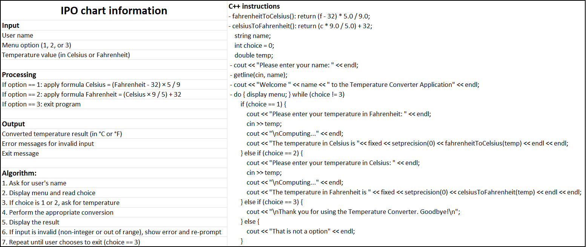
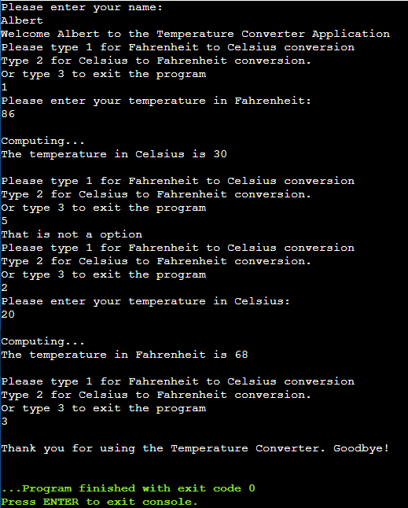

# IT-160 – Programming Logic - Final Exam Project

**Project Name:** Temperature Converter  
**Student Name:** Ninglu Tang  
**Programming File Name:** `tempconverter.cpp`

---

## 💡 Project Purpose

The goal of this project is to develop an interactive C++ application that converts temperatures between Fahrenheit and Celsius. 

---

## 📊 IPO Chart



## ⚙️ Program Development Approach

### Planning

- Started with the IPO chart to clarify the core input, processing, and output of the program.
- Outlined the main control flow: repeatedly show a menu, accept valid input and perform conversion.

### Design & Implementation

- Used a `do-while` loop to allow repeated conversions until the user selects exit.
- Utilized `if-else` logic for robust input validation: only accept integers 1/2/3 as menu options.
- Provided two dedicated functions for conversions: `fahrenheitToCelsius()` and `celsiusToFahrenheit()`.
- Employed `setprecision(0)` to format output for readability.

---

## 🧩 Challenges Faced and Reflections

### Hardships

- **Input Validation:**  
  It was challenging to make the program robust against all types of invalid input. Originally, directly reading `int` from `cin` allowed non-integer or out-of-range input to cause logical errors or infinite loops.
- **IPO Chart Creation:**  
  Breaking down the temperature converter into IPO steps seemed simple, but identifying *all* possible user interactions (especially error handling and repeated prompts) required careful thought.
- **Loop and Menu Logic:**  
  Ensuring the loop worked as expected and that the program would not crash or skip prompts due to bad input took multiple iterations of testing and debugging.

### What Could Make It Easier

- Reviewing more real-world IPO chart samples before starting。
- Drafting the full pseudocode before coding。

### What I Would Do Differently Next Time

- Add more comprehensive input validation, including catching non-numeric temperature entries.
- Make the program more user-friendly by allowing users to return to the state after invalid input, not just re-prompt for the menu option.

---

## 🧠 Lessons Learned

- How to structure and build a menu-driven console application in C++.
- The importance of input validation for robust user interaction.
- How breaking down a program into IPO chart steps helps clarify logic before coding.

---

## 🛠 How to Run and Test the Program

1. **Open your C++ IDE** (such as Code::Blocks, Visual Studio, or use an online compiler) or using command line on ubuntu-22.04.
2. **Compile** the program:  
   ```bash
   g++ -std=c++11 -o tempconverter tempconverter.cpp
3. **Run** the program:
   ```bash
   ./tempconverter
4. Test as follows:

   1. **Start the program.**  
      You will see the prompt:
      ```bash
      Please enter your name:
      ```
      Type your name (e.g., `Albert`) and press Enter.

   2. **View the welcome message and menu options.**  
   The program should display:
      ```bash
      Welcome Albert to the Temperature Converter Application
      Please type 1 for Fahrenheit to Celsius conversion
      Type 2 for Celsius to Fahrenheit conversion.
      Or type 3 to exit the program
      ```

   3. **Test Fahrenheit to Celsius conversion.**  
   - Enter `1` and press Enter.
   - You will be prompted:
     ```
     Please enter your temperature in Fahrenheit
     ```
   - Input a value, such as `86`, and press Enter.
   - The program will display the result:
     ```
     Computing...
     The temperature in Celsius is 30
     ```

   4. **Test error handling with an invalid option.**  
   - When prompted with the menu, enter an invalid option such as `5` and press Enter.
   - The program should display:
      ```
      That is not an option.
      ```
   - The menu will be shown again for a valid selection.

   5. **Test Celsius to Fahrenheit conversion.**  
   - Enter `2` at the menu prompt and press Enter.
   - The program will ask:
      ```
      Please enter your temperature in Celsius
      ```
   - Input a value, such as `20`, and press Enter.
   - The program will show:
      ```
      Computing...
      The temperature in Fahrenheit is 68
      ```

   6. **Exit the program.**  
   - Enter `3` at the menu prompt.
   - The program should display a farewell message:
     ```
     Thank you for using the Temperature Converter. Goodbye!
     ```

   